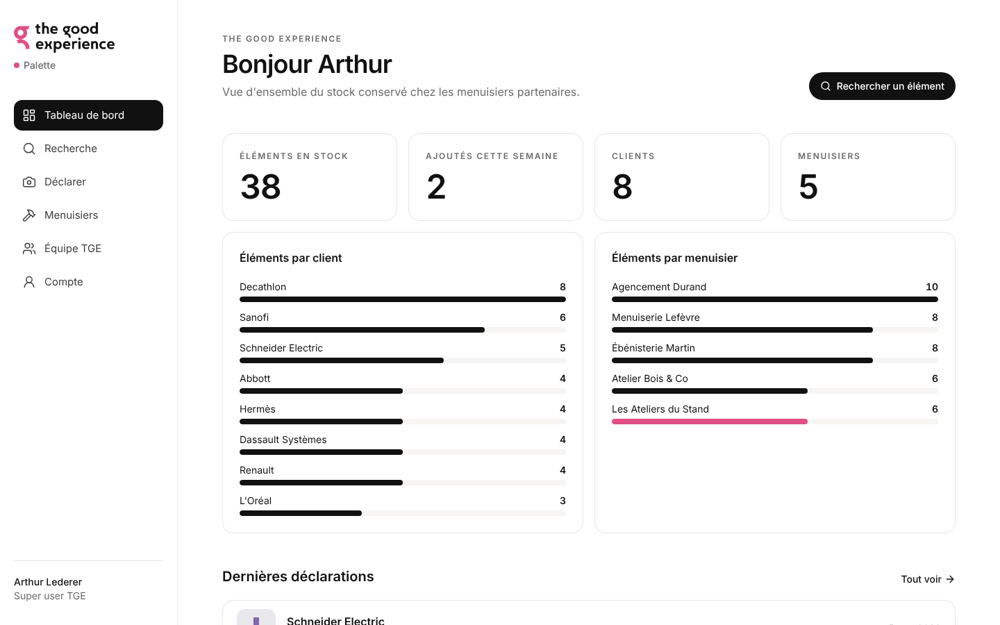
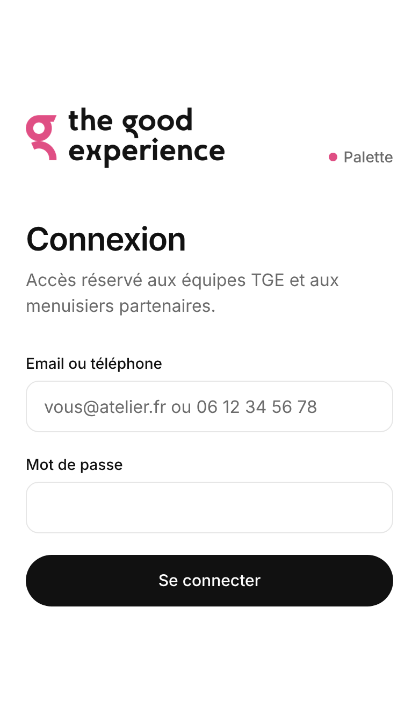

# Palette · The Good Experience

Palette est l'outil d'inventaire des éléments de stands stockés chez les menuisiers partenaires de **The Good Experience**.
Il répond à trois questions que personne ne pouvait trancher jusqu'ici : **qu'avons-nous en stock, où, et chez quel menuisier ?**
Objectif : ne plus refabriquer un élément existant (≈ 3 500 € par incident) ni jeter un élément réutilisable.

- **Menuisiers** (mobile) : déclarent un élément en une seule page depuis l'atelier (photo, client, dimensions L × H × P, projet, emplacement), retrouvent, modifient ou suppriment leurs propres déclarations. Ils ne voient jamais celles des autres ateliers.
- **Équipes TGE** (desktop et mobile) : tableau de bord, recherche multi-critères (client, plages de dimensions, projet, menuisier, mots-clés), fiche détaillée avec contact du menuisier et historique, export CSV, gestion des menuisiers et des comptes, modération.

| Tableau de bord | Connexion (mobile) | Déclaration (mobile) |
|---|---|---|
|  |  |  |

## Documentation

| Document | Pour qui |
|---|---|
| [Guide menuisier](docs/GUIDE-MENUISIER.md) | Menuisiers partenaires |
| [Guide super user](docs/GUIDE-SUPER-USER.md) | Équipes The Good Experience |
| [Décisions d'architecture](docs/ARCHITECTURE.md) | Développeurs, DSI |
| [Déploiement](docs/DEPLOIEMENT.md) | Mise en production |
| [Rapport de tests](docs/RAPPORT-TESTS.md) | Dernier rapport généré |

## Démarrer en local

Prérequis : **Node.js 20+** (22 recommandé) et **PostgreSQL 14+** (ou Docker).

```bash
# 1. Dépendances
npm install

# 2. Base de données : PostgreSQL via Docker (crée aussi les bases de test)
docker compose up -d
#    … ou une instance existante : créez les bases palette, palette_test et palette_e2e.

# 3. Configuration
cp .env.example .env          # puis renseignez SESSION_SECRET (openssl rand -base64 48)

# 4. Schéma + données de démonstration
npm run db:migrate            # applique les migrations
npm run db:seed               # 1 super user, 5 menuisiers, ~40 éléments avec photos

# 5. Lancer
npm run dev                   # http://localhost:3000
```

Comptes de démonstration créés par `db:seed` :

| Rôle | Identifiant | Mot de passe |
|---|---|---|
| Super user TGE | `admin@thegoodexperience.com` | `Palette2026` |
| Menuisier (Atelier Bois & Co) | `julien@boisandco.fr` ou `06 12 34 56 01` | `Atelier2026` |
| Menuisier (Menuiserie Lefèvre) | `claire@lefevre-menuiserie.fr` | `Atelier2026` |

> `db:seed` efface les données existantes : ne jamais le lancer sur la base de production.

Pour tester sur un téléphone en local : `npm run dev -- -H 0.0.0.0` puis ouvrir `http://<ip-du-poste>:3000` sur le même Wi-Fi.

## Scripts

| Commande | Rôle |
|---|---|
| `npm run dev` | Serveur de développement |
| `npm run build` / `npm start` | Build et serveur de production |
| `npm run typecheck` / `npm run lint` | Vérifications TypeScript et ESLint |
| `npm run db:migrate` | Crée / applique une migration (dev) |
| `npm run db:deploy` | Applique les migrations (production) |
| `npm run db:seed` | Données de démonstration |
| `npm test` | Tests unitaires + intégration (Vitest) |
| `npm run test:e2e` | Tests de bout en bout (Playwright, nécessite `npm run build`) |
| `npm run test:all` | Toutes les suites + rapport consolidé dans `reports/` |

## Tests

- **Unitaires** (`tests/unit`) : validation des formulaires, filtres de recherche, CSV (dont protection contre l'injection de formules), jetons de session, stockage, traitement des photos.
- **Intégration** (`tests/integration`) : services métier contre une vraie base PostgreSQL. Couvre en priorité le **cloisonnement entre menuisiers**, la recherche multi-critères, l'historique, la gestion des comptes, le blocage après échecs de connexion.
- **Bout en bout** (`tests/e2e`) : parcours réels dans Chromium sur desktop, iPhone portrait et paysage (déclaration avec photo, compression, recherche par dimensions, export CSV, isolation par URL directe, taille des boutons tactiles…).

`npm run test:all` produit `reports/RAPPORT-TESTS.md` (synthèse) et les rapports HTML détaillés (Vitest, couverture, Playwright).
Résultat actuel : **106 tests, tous au vert**, couverture du code métier ≈ 88 % des lignes ([rapport](docs/RAPPORT-TESTS.md)).

## Structure

```
prisma/              schéma, migrations, données de démonstration
src/
  app/               pages et routes (App Router)
    (app)/           pages connectées : declarer, elements, tableau-de-bord, menuisiers, equipe, compte
    api/             photos protégées, export CSV, sonde de santé
    connexion/       page et actions de connexion
  components/        composants d'interface (formulaire de déclaration, cartes, navigation…)
  lib/               utilitaires : env, base, validation, stockage, images, CSV, auth
  server/            logique métier et règles d'accès (testées indépendamment de l'interface)
  middleware.ts      redirection vers la connexion
tests/               unit, integration, e2e
docs/                guides, architecture, déploiement, rapport de tests
brand/               logo source TGE (déclinaisons générées par scripts/brand-assets.mjs)
```
