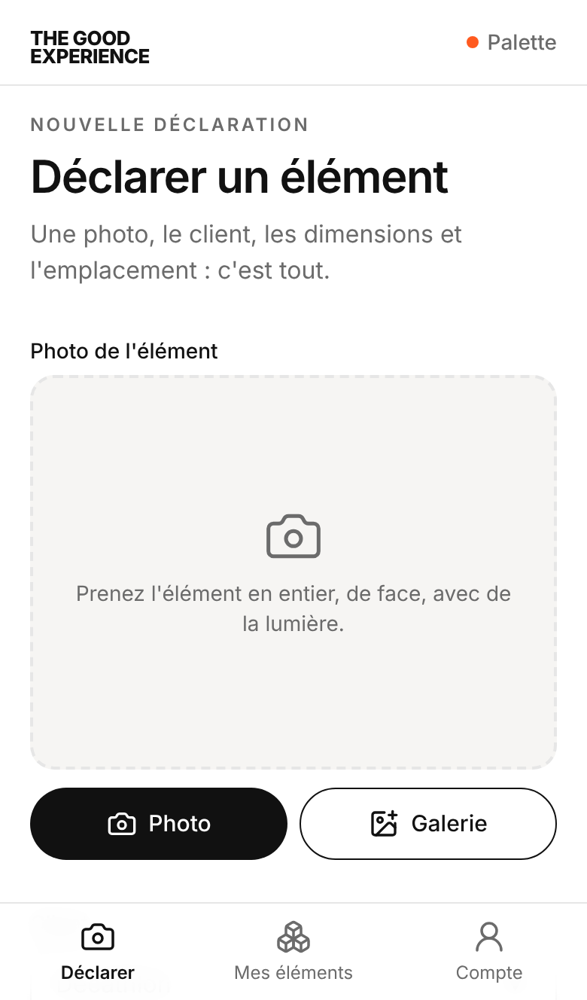
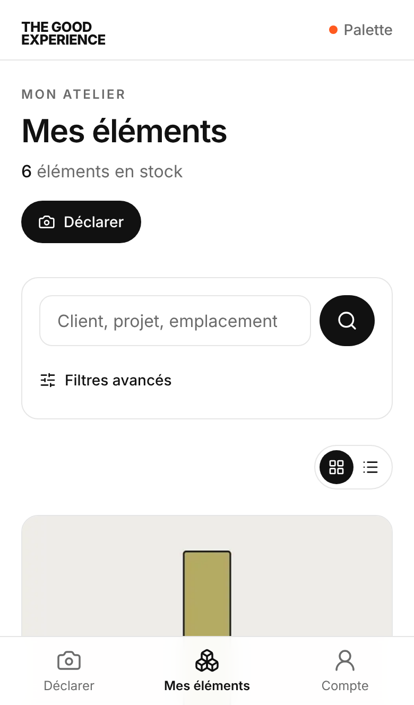

# Guide menuisier · Palette

Palette permet à The Good Experience de savoir quels éléments de stands vous stockez pour elle, et où ils se trouvent dans votre atelier. Vous déclarez chaque élément en moins d'une minute depuis votre téléphone.

## 1. Se connecter

1. Ouvrez le lien de Palette envoyé par The Good Experience dans le navigateur de votre téléphone (Safari, Chrome…).
2. Saisissez votre **email ou votre numéro de téléphone**, puis votre mot de passe.
3. Vous restez connecté 30 jours sur ce téléphone.

**Conseil : ajoutez Palette à votre écran d'accueil**, elle s'ouvrira comme une application.
- iPhone (Safari) : bouton Partager → « Sur l'écran d'accueil ».
- Android (Chrome) : menu ⋮ → « Ajouter à l'écran d'accueil ».

Mot de passe oublié ou compte bloqué : contactez votre interlocuteur chez The Good Experience, qui peut le réinitialiser. Après 5 essais erronés, la connexion est bloquée 15 minutes.

## 2. Déclarer un élément

L'écran **Déclarer** s'ouvre directement après la connexion. Tout se fait sur une seule page.

1. **Photo** : touchez *Photo* pour prendre l'élément en photo, ou *Galerie* pour en choisir une existante. Cadrez l'élément en entier, de face, avec de la lumière. La photo est allégée automatiquement avant l'envoi.
2. **Client** : commencez à taper, Palette propose les clients existants. Si le client n'existe pas encore, tapez simplement son nom.
3. **Dimensions** en centimètres, nombres entiers : **L** longueur, **H** hauteur, **P** profondeur.
4. **Projet d'origine** : le salon ou l'événement pour lequel l'élément a été fabriqué (ex. « VivaTech 2025 »).
5. **Localisation dans l'atelier** : là où vous l'avez rangé (ex. « Zone A - Étagère 3 »). Vos emplacements habituels sont proposés.
6. **Notes** (optionnel) : état, pièces manquantes, particularités.
7. Touchez **Enregistrer l'élément**.

Un champ mal rempli s'affiche en rouge avec une explication, dès que vous passez au champ suivant. Si l'envoi échoue (réseau), votre saisie est conservée : réessayez quand le réseau revient.

Le téléphone peut être tenu en **portrait ou en paysage**.

## 3. Retrouver mes éléments

L'onglet **Mes éléments** liste tout ce que vous avez déclaré, le plus récent en premier.

- Recherchez par mot (client, projet, emplacement, notes).
- *Filtres avancés* : client, projet, plages de dimensions, tri.
- Basculez entre vue **cartes** (avec photo) et vue **liste**.

Vous ne voyez que les éléments de votre atelier. Les déclarations des autres menuisiers ne vous sont jamais visibles, et les vôtres ne leur sont pas visibles non plus.

## 4. Modifier ou supprimer

Touchez un élément pour ouvrir sa fiche, puis :
- **Modifier** : changez un champ ou reprenez la photo, puis *Enregistrer les modifications*. Chaque modification est notée dans l'historique en bas de la fiche.
- **Supprimer** : quand l'élément a été repris, jeté ou ne vous concerne plus. Une confirmation est demandée.

## 5. Mon compte

L'onglet **Compte** permet de changer votre mot de passe et de vous déconnecter.
