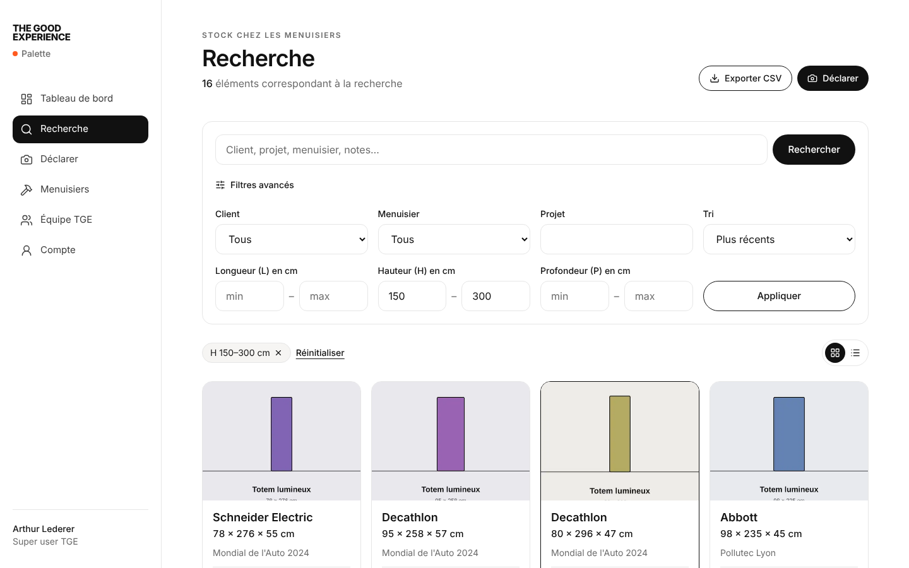
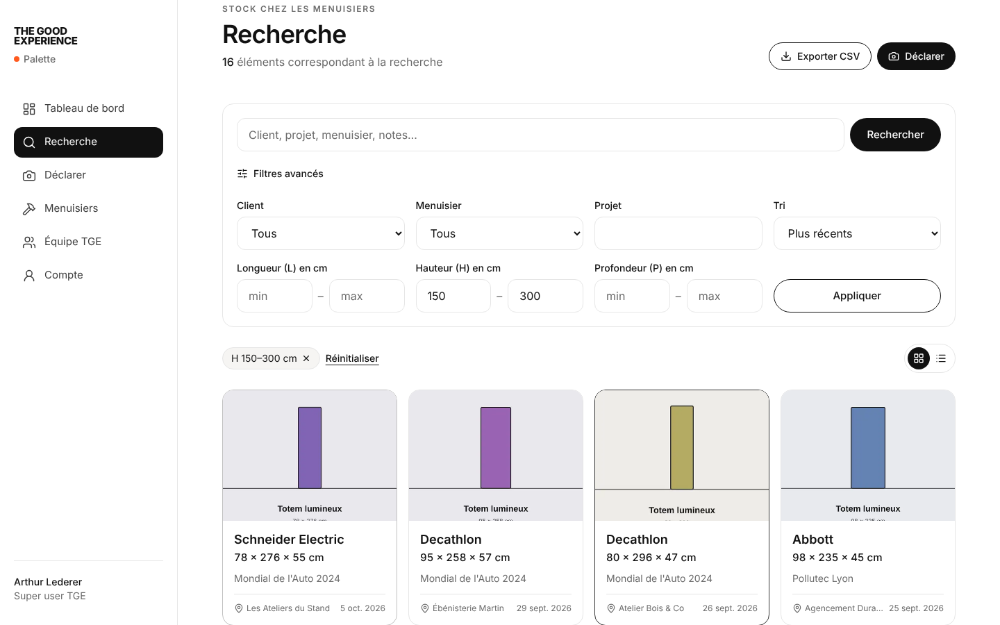
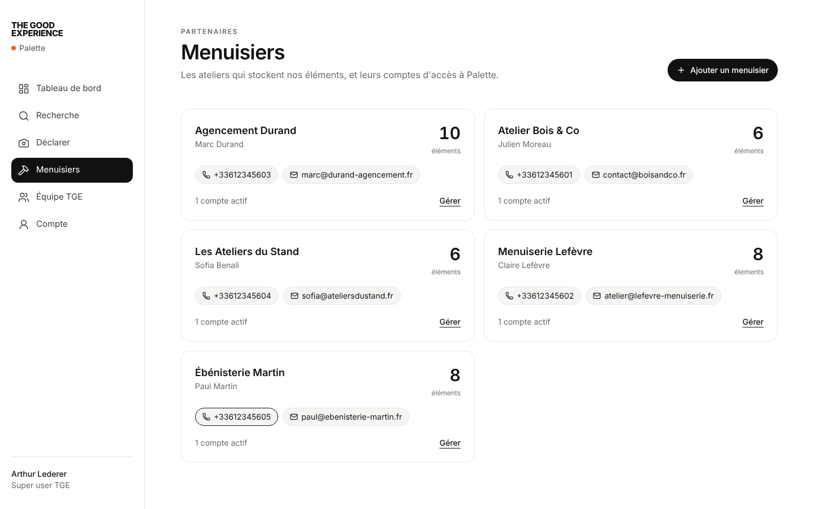

# Guide super user · Palette (équipes The Good Experience)

En tant que super user, vous voyez l'ensemble du stock conservé chez les menuisiers partenaires, vous gérez les menuisiers et leurs comptes, et vous pouvez modérer les déclarations.

Palette fonctionne sur ordinateur comme sur téléphone. Sur ordinateur, la navigation est dans la barre latérale ; sur téléphone, dans la barre d'onglets en bas.

## 1. Tableau de bord

- **Éléments en stock**, ajoutés cette semaine, nombre de clients et de menuisiers.
- **Éléments par client** et **par menuisier** : cliquez sur une barre pour voir les éléments correspondants.
- **Dernières déclarations** : les six plus récentes.

## 2. Rechercher un élément

Avant de lancer une fabrication, vérifiez dans **Recherche** si un élément réutilisable existe déjà.

- **Mots-clés** : cherchent dans le client, le projet, le menuisier, l'emplacement et les notes. Plusieurs mots : tous doivent être présents (ex. `abbott totem`).
- **Filtres avancés** :
  - Client, menuisier, projet ;
  - **plages de dimensions** en cm, par exemple hauteur 150 à 200 et longueur 300 à 400. Une seule borne suffit (ex. hauteur ≥ 200) ;
  - tri : plus récents, plus anciens, client, plus grands.
- Les **filtres actifs** s'affichent sous la recherche : cliquez sur ✕ pour en retirer un, ou sur *Réinitialiser*.
- Vue **cartes** ou **liste**.
- L'adresse de la page contient vos filtres : copiez-la pour partager une recherche avec un collègue.
- **Exporter CSV** : télécharge les résultats de la recherche en cours, ouvrable directement dans Excel.

## 3. Fiche d'un élément

- Cliquez sur la photo pour l'afficher en **plein écran** (Échap pour fermer).
- Toutes les informations : client, dimensions, projet, emplacement chez le menuisier, notes, date et auteur de la déclaration.
- **Contact du menuisier** : boutons pour l'appeler ou lui écrire directement.
- **Historique des modifications** : création, chaque champ modifié (ancienne → nouvelle valeur), avec date et auteur.
- **Modifier** ou **Supprimer**. Une suppression par un super user est une **modération** : indiquez un motif (ex. « doublon », « élément jeté »), il est conservé dans le journal.

## 4. Déclarer pour le compte d'un menuisier

Le menu **Déclarer** fonctionne comme pour un menuisier, avec un champ supplémentaire : le menuisier qui stocke l'élément. Utile pour saisir un stock existant lors d'une visite d'atelier.

## 5. Gérer les menuisiers

**Menuisiers** liste les ateliers avec leurs coordonnées, leur nombre d'éléments et de comptes actifs.

- **Ajouter un menuisier** : nom de l'atelier, contact, téléphone, email, adresse et notes internes (optionnelles).
- **Gérer** un menuisier :
  - modifier ses coordonnées ;
  - **créer un compte** de connexion pour chaque personne de l'atelier (nom, email, téléphone facultatif, mot de passe initial). Transmettez l'identifiant et le mot de passe à la personne : elle pourra le changer dans *Compte* ;
  - **Mot de passe** : définir un nouveau mot de passe pour un compte ;
  - **Désactiver** un compte : la personne perd l'accès immédiatement, ses déclarations restent. *Réactiver* pour lui redonner l'accès ;
  - **Supprimer le menuisier** : possible seulement s'il ne stocke plus aucun élément, pour ne jamais perdre la trace d'un stock.

Un compte menuisier ne voit que les éléments de son atelier.

## 6. Équipe TGE

**Équipe TGE** liste les super users et permet d'en ajouter. Vous ne pouvez pas désactiver votre propre compte, et il reste toujours au moins un super user actif.

## 7. Bonnes pratiques

- Chercher avant de fabriquer : par client, puis par dimensions avec une marge (± 10 cm).
- Garder des noms de projets homogènes (« VivaTech 2025 » plutôt que « vivatech » ou « Viva 25 ») : l'autocomplétion aide les menuisiers à réutiliser les mêmes.
- Désactiver plutôt que supprimer les comptes des personnes qui quittent un atelier.
